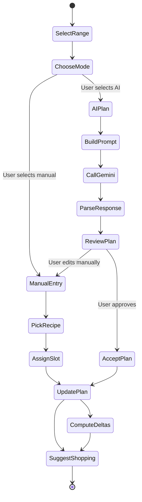

# Activity Diagram — Meal Planning with AI Assistance

## Notes
- `BuildPrompt` compiles inventory, dietary preferences, and timeframe into Gemini prompt.
- `ParseResponse` handles fallback if AI output invalid.
- `ComputeDeltas` calculates ingredient shortages used for shopping list suggestions.
