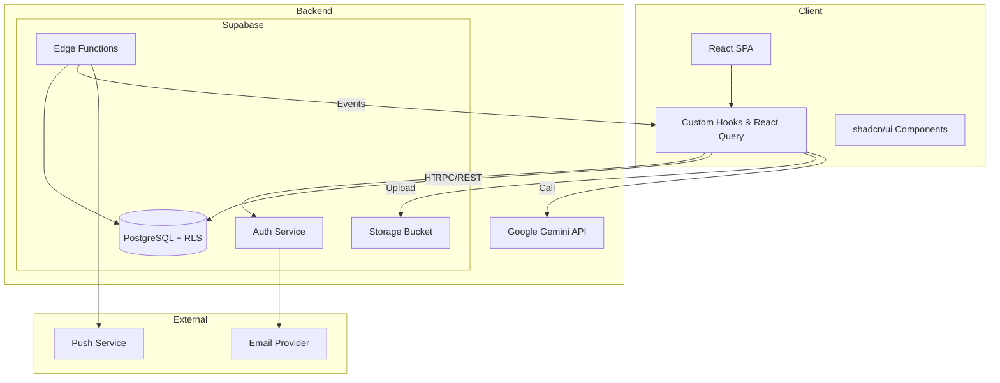

# System Architecture Diagram — The Next Food

## Notes
- Client communicates directly with Supabase and Gemini; no custom backend server currently.
- Edge Functions planned for background tasks (notifications, barcode lookup).
- Observability (Sentry, analytics) to be integrated as part of cross-cutting concerns.
