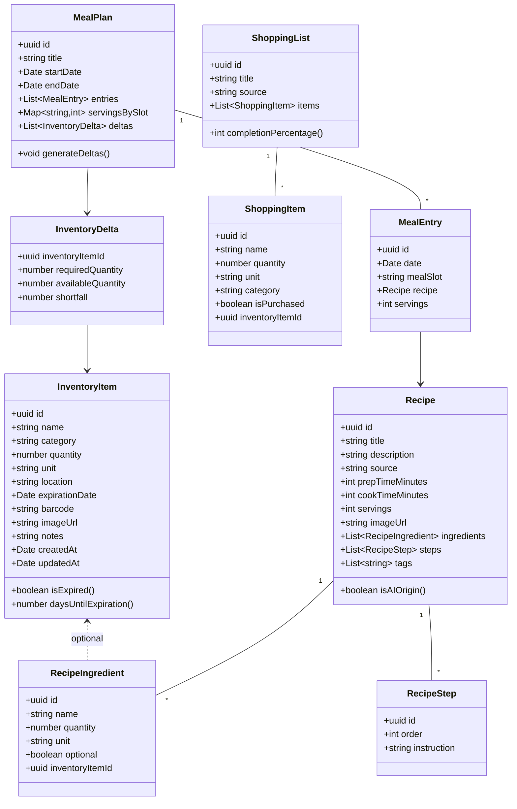

# Class Diagram — Domain Models

## Notes
- Diagram focuses on domain-layer TypeScript models used in hooks/services.
- Methods reflect business logic (expiration calculations, delta generation).
- Actual implementation may use interfaces/types rather than classes; diagram abstracts structure.
