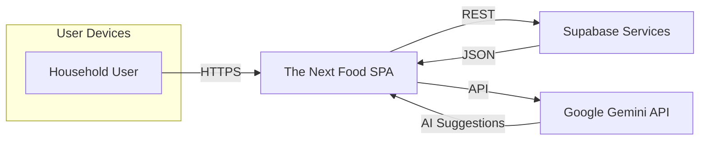
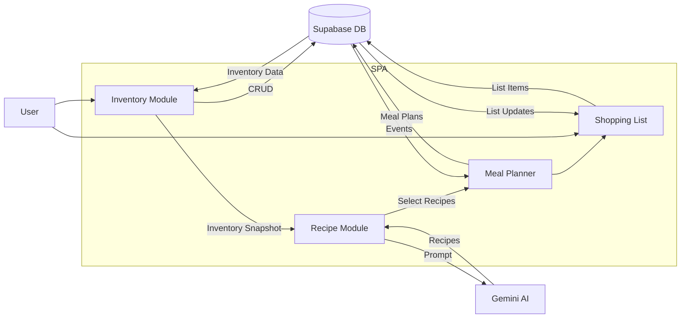
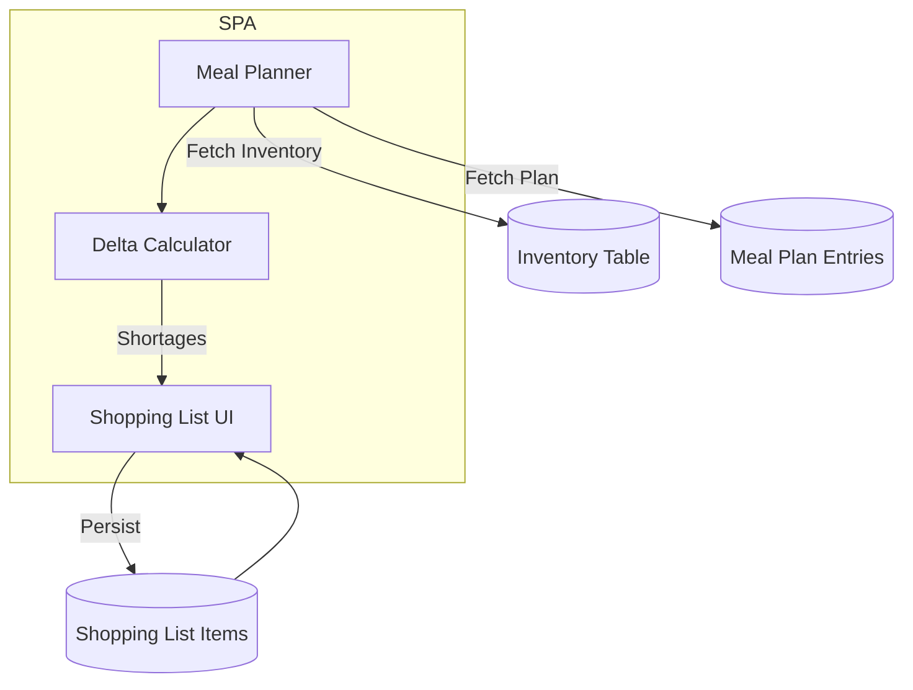

# Data Flow Diagrams — The Next Food

## Level 0 (Context Diagram)

## Level 1 — Inventory & Meal Planning

## Level 2 — Shopping List Generation Detail

## Notes
- DFD focuses on data movement; control flow described in `docs/design/process-flows.md`.
- Supabase Edge Functions (future) will introduce additional processes (notifications, barcode lookups).
