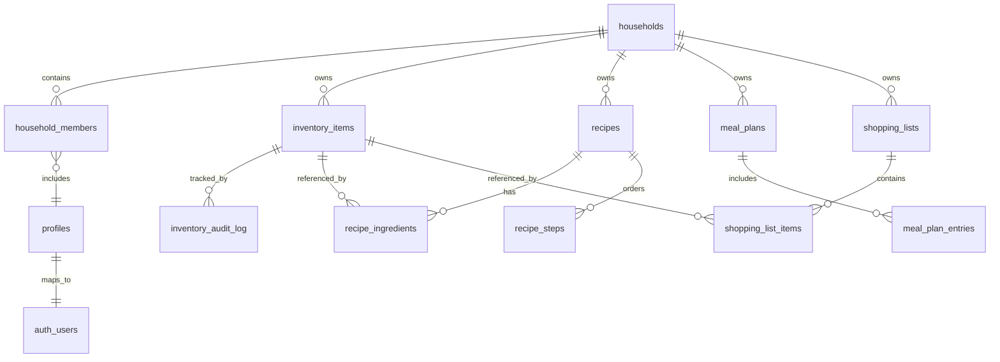

# Entity Relationship Diagram — The Next Food

## Key Notes
- `auth_users` represents Supabase auth schema table.
- Optional relationships (dashed) indicate lookup references used to link recipes/shopping items back to inventory.
- Additional future entities (notifications, nutrition_profiles) described in `docs/design/database.md`.
