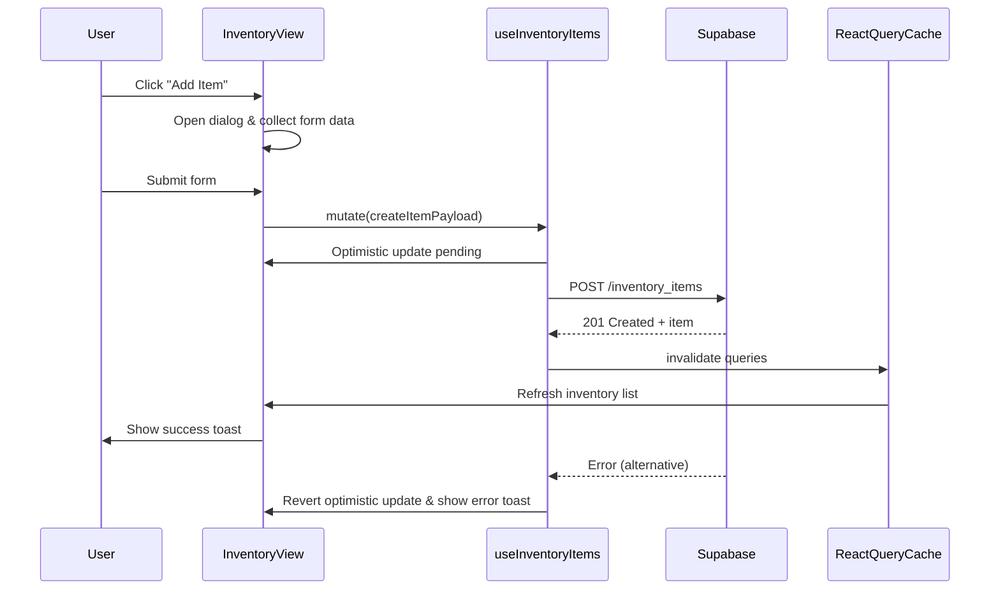

# Sequence Diagram — Inventory Item Creation

```mermaid
sequenceDiagram
    participant U as User
    participant UI as InventoryView
    participant Hook as useInventoryItems
    participant Supa as Supabase
    participant Cache as ReactQueryCache

    U->>UI: Click "Add Item"
    UI->>UI: Open dialog & collect form data
    U->>UI: Submit form
    UI->>Hook: mutate(createItemPayload)
    Hook->>UI: Optimistic update pending
    Hook->>Supa: POST /inventory_items
    Supa-->>Hook: 201 Created + item
    Hook->>Cache: invalidate queries
    Cache->>UI: Refresh inventory list
    UI->>U: Show success toast
    Supa-->>Hook: Error (alternative)
    Hook->>UI: Revert optimistic update & show error toast
```

## Notes
- Sequence assumes React Query mutation pattern with optimistic updates.
- Barcode scanning sits before form submission (future extension).
